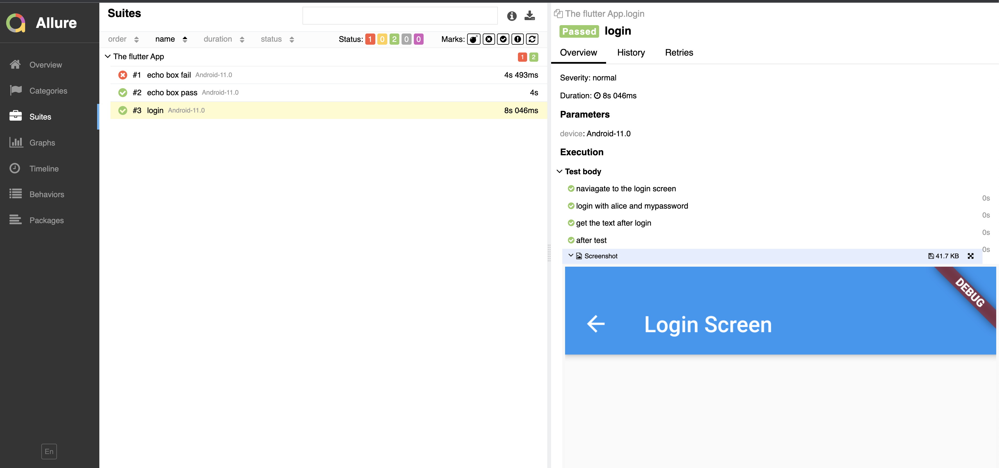

# WebdriverIO Appium Flutter Demo<a href="https://webdriver.io/"></a> <a href="https://nodejs.org/en/"></a> <a href="https://mochajs.org/"></a> <a href="https://flutter.dev/"></a>

## Introduction

WebdriverIO is a progressive automation framework built to automate modern web and mobile applications. It simplifies the interaction with your app and provides a set of plugins that help you create a scalable, robust and flakiness test suite.

This repository demonstrates a WebdriverIO tests framework written in Mocha and nodeJS with android flutter testing capabilities. The WebdriverIO test scripts are written for the open source The Flutter App ([Github](https://github.com/abhi2810/the_app_flutter)).

---

## Repository setup

- Clone the repository
- Set the correct node version via NVM (optional but recommended)
  ```sh
  # brew command to install nvm
  $ brew install nvm
  # pick the node version from .nvmrc and install the version
  $ nvm install
  # use the node version which is compatible
  $ nvm use
  ```
- Run below command to configure dependencies

  ```sh
  npm install
  ```

## Running Your Tests

- How to run the test?

  - To run the default test scenario (e.g. End to End Scenario) on local, use the following command:

  ```sh
  npm test
  ```

## Generating Allure Reports

- Generate Report using the following command: 

  ```sh
  npm run generate-report
  ```
 - sample report 
  
